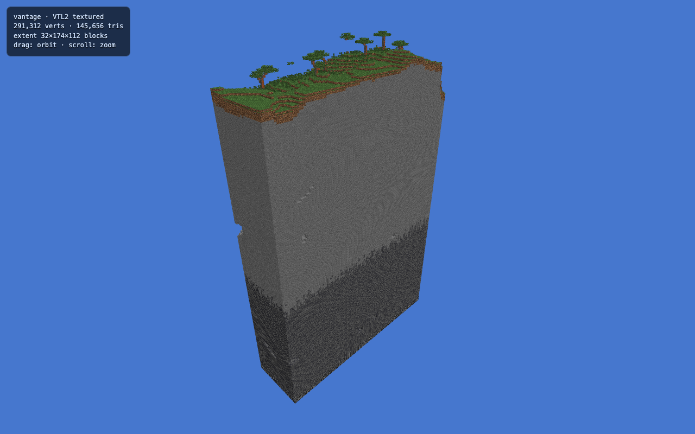
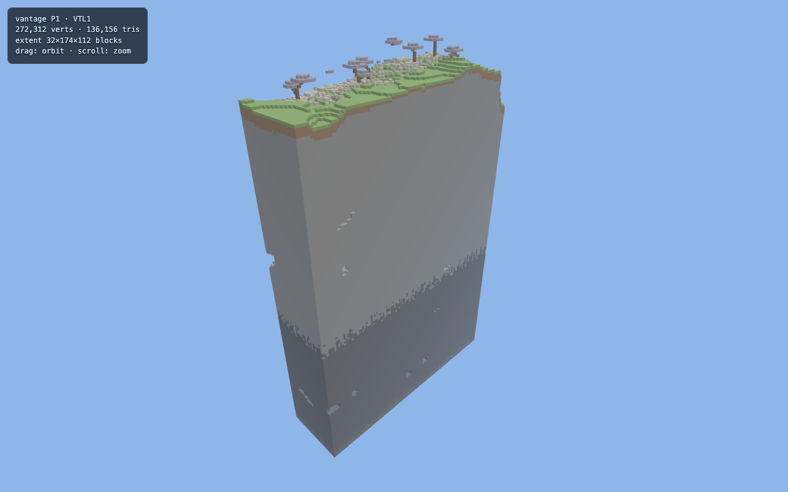

# Vantage

[](https://github.com/thoughts-on-things/vantage-mc/actions/workflows/ci.yml)

A high-performance Minecraft (Java Edition) world → 3D web map renderer, written in Zig.

Vantage turns a Minecraft world into a fast, beautiful, navigable 3D map in the
browser. It is a from-scratch reimagining of [BlueMap](https://github.com/BlueMap-Minecraft/BlueMap)
with four ordered goals:

1. **Performance** — generate maps of large worlds as fast as possible, using as
   little CPU, RAM, and disk as possible.
2. **Correctness** — render the world as faithfully as the live in-game view.
3. **Usability** — never break across Minecraft updates; trivial to deploy and scale.
4. **Fidelity** — modern, configurable, high-quality rendering. The next leap.

The design: a **native Zig generator** (multithreaded, arena-per-region, SIMD hot
paths) bakes quantized, indexed geometry tiles; a **thin web renderer**
(three.js, WebGL2 + WebGPU) streams and shades them; an optional **live daemon +
companion plugin** push real-time player and block-edit updates onto the 3D map.

See **[DESIGN.md](./DESIGN.md)** for the full architecture, decisions, and roadmap.

## Status

Early, but it draws — with real textures. **Phases 0–2 (core) are complete.**

- **P0 — parsing spike:** reads real Anvil region files, decompresses chunks
  (zlib via C interop), parses NBT, and unpacks the paletted block-state arrays.
- **P1 — vertical slice:** the full tracer bullet, *world file → pixels in a
  browser.* Dense block grid → **culled, indexed** cube mesh → versioned binary
  tile (`VTL1`) → three.js viewer.
- **P2 — model & texture resolver:** the vanilla resource pipeline —
  blockstate → variant → model parent-chain → resolved elements/faces with
  textures, UVs, cullface, rotation, tint. Decodes vanilla PNGs (vendored
  stb_image) into a **texture array**, and a textured mesher emits geometry with
  per-face texture layers sampled by a WebGL2 `sampler2DArray` shader. Remaining
  P2 hardening (state-accurate variants, multipart, biome-colormap tint, KTX2,
  asset auto-download) is in progress.

Textured render of the beacon 1.21.4 world (stone→deepslate strata, grass, acacia trees):



<details><summary>P1 flat-color render (for comparison)</summary>


</details>

## Build & run

Requires [Zig](https://ziglang.org) `0.16.0`.

```sh
zig build                 # build the `vantage` binary into zig-out/bin
zig build test            # run unit tests
```

### Render terrain in the browser

Textured (P2) — needs an extracted `assets/minecraft` dir (Minecraft 26.2+):

```sh
# 1. Mesh a rectangle of chunks (region-local coords 0..31, inclusive) with textures.
./zig-out/bin/vantage meshtex path/to/region/r.0.0.mca web/terrain.vtile \
    ~/.cache/vantage/assets/26.2/assets/minecraft 0 0 10 15

# 2. Serve the viewer and open it.
( cd web && python3 -m http.server 8753 )
# → http://127.0.0.1:8753/index.html   (drag to orbit, scroll to zoom)
```

Flat-color (P1, no assets needed): use `mesh` instead of `meshtex` and drop the
assets argument. The viewer auto-detects the tile version.

> The block model/texture schema is unchanged from 1.21.x, so any modern version
> works; the world side is version-agnostic. Asset extraction is currently manual
> (auto-download is a pending P2 slice):
> `unzip -oq <client>.jar 'assets/minecraft/blockstates/*' 'assets/minecraft/models/block/*' 'assets/minecraft/textures/block/*' 'assets/minecraft/textures/colormap/*' -d ~/.cache/vantage/assets/26.2`

```
region:    .../r.0.0.mca
chunks:    176 loaded, 0 missing  (range 0,0..10,15)
grid:      176 x 384 x 256 blocks  (minY=-64)
mesh:      272312 vertices, 68078 quads, 136156 triangles
tile:      web/terrain.vtile  (7080128 bytes)
```

### Inspect a chunk's blocks

```sh
./zig-out/bin/vantage histo path/to/world/region/r.0.0.mca 0 0
```

```
chunk (0,0): DataVersion=4189, 24 sections
non-air blocks: 38040
distinct types: 26
top blocks:
      16663  minecraft:stone
      14948  minecraft:deepslate
        ...
```

## License

TBD.
