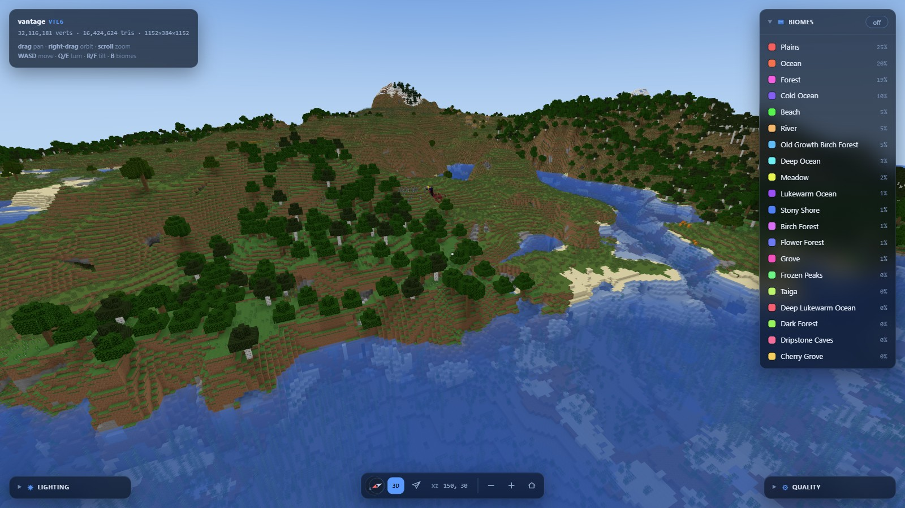
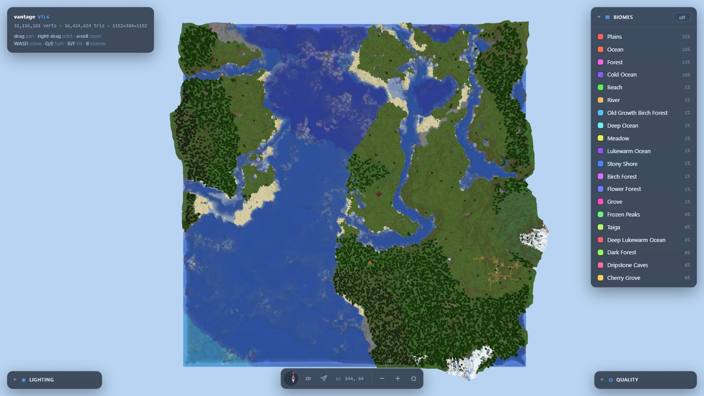
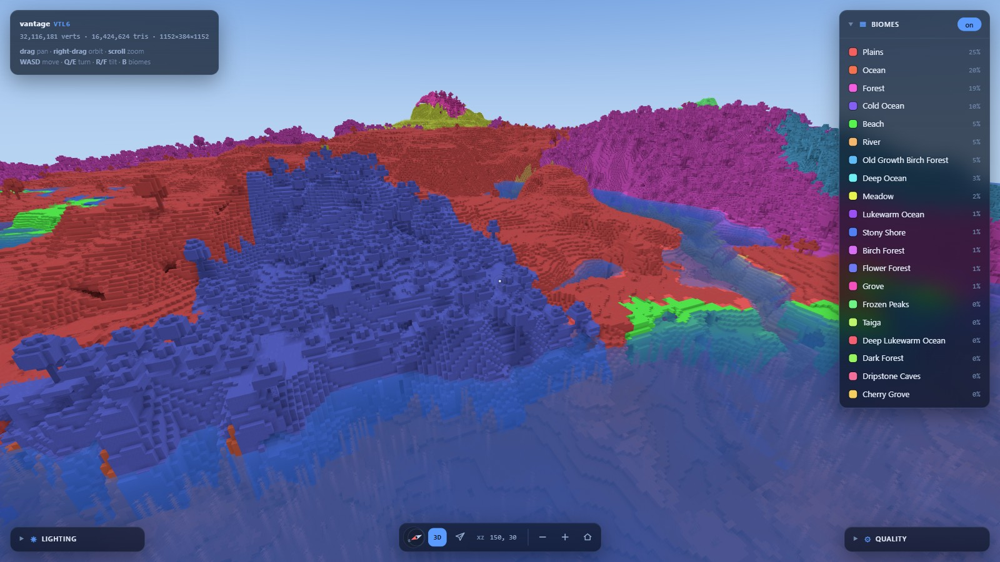

# Vantage

[](https://github.com/thoughts-on-things/vantage-mc/actions/workflows/ci.yml)
[](./LICENSE)

A high-performance Minecraft (Java Edition) world → 3D web map renderer, written in Zig.

**Live demo: [vantage.beacon-mc.io](https://vantage.beacon-mc.io)** — the real
viewer streaming a real world, plus a measured side-by-side against BlueMap.

Vantage turns a Minecraft world into a fast, beautiful, navigable 3D map in the
browser, built around four ordered goals:

1. **Performance** — generate maps of large worlds as fast as possible, using as
   little CPU, RAM, and disk as possible.
2. **Correctness** — render the world as faithfully as the live in-game view.
3. **Usability** — never break across Minecraft updates; trivial to deploy and scale.
4. **Fidelity** — modern, configurable, high-quality rendering.



## How it works

A **native Zig generator** (no JVM, no GC, vendored C decompressors) reads a
world's region files directly and bakes quantized, indexed geometry tiles plus a
lowres LOD pyramid; a **thin web renderer** ([`@thoughts-on-things/vantage-mc`](./web/README.md) —
three.js, WebGL2) streams and shades them. The two sides are decoupled by a
versioned binary tile contract, so each can evolve independently.

- **Whole-world tiled streaming** — every populated chunk is baked into
  gzip-wrapped tiles + a manifest; the viewer streams them around the camera
  (nearest-first, distance-based unload), so world size doesn't matter.
- **GPU dequantization** — tiles upload in their on-disk quantized encoding and
  the vertex shader dequantizes, so arriving tiles cost the main thread nearly
  nothing and panning stays stutter-free.
- **LOD pyramid** — a quadtree of colored heightfields (~1% of the hires bytes)
  keeps the *entire* world visible: zoom out to a whole-world satellite view,
  never a fog wall.
- **Real assets, no hardcoding** — models, textures, biome colors, and display
  names are all read from the game's own files, so a new Minecraft version
  "just works".
- **Interactive layers** — biome layer with a clickable legend, lighting panel,
  quality presets, free-flight camera.
- **Shareable views** — the camera lives in the URL hash, so any view of the
  map is a deep link you can paste to someone.

| Whole-world satellite view (LOD pyramid) | Biome layer |
| --- | --- |
|  |  |

Measured on a dense 7,225-chunk 1.21 world (Windows, 16 threads, ReleaseFast):
**~3.4 s** end-to-end for 81 tiles + a 3-level LOD pyramid, **~25 MB on disk**
(the compact quad encoding ships no index data, delta-codes positions, and
stores fixed-point UVs — 5× smaller than the previous format), streaming at
120+ FPS. Baked light and AO live in per-tile lightmap atlases, so greedy
meshing merges across lighting gradients: ~23% fewer vertices (~12.8M
triangles resident for the whole world) with per-block light fidelity intact.
Tiles render in parallel across all cores by default; `--gz` trades size
against write time (1..12, default 9).

## Quick start

Requires [Zig](https://ziglang.org) `0.16.0` and Node 18+. A
[`Justfile`](./Justfile) wraps the common tasks ([`just`](https://just.systems)):

```sh
just build         # build the binary into zig-out/bin
just test          # run unit tests
just web-install   # once: install the viewer's npm deps
```

### 1. Extract assets

Vantage reads models, textures, and biome data straight from a Minecraft client
jar (Mojang's assets aren't redistributable, so you extract them once from your
own copy — anything from 1.18 up through the current year-versioned releases
works). If Minecraft is installed locally this happens **automatically on the
first render**; otherwise (or to re-extract) point the built-in extractor at
any client jar:

```sh
vantage extract                                      # newest jar in .minecraft/versions
vantage extract ~/.minecraft/versions/26.2/26.2.jar  # …or an explicit one
```

The subset a render needs lands in `~/.cache/vantage/assets/<version>` (a few
MB — blockstates, block models and textures, colormaps, biome data).

### 2. Render your world

Point it at a save folder (the one with `level.dat`). It finds the region files
and the extracted assets, renders **the whole populated world** as streamable
tiles, and shows a progress bar:

```sh
just render "~/.minecraft/saves/My World"
just serve         # → http://127.0.0.1:8753/
#   drag to pan · right-drag to orbit · scroll to zoom · B = biome layer
```

The renderer only ever reads the world — it never writes to it. Useful flags:

- `--out <dir>` — output directory (default `web/public`).
- `--assets <dir>` — the extracted `assets/minecraft` directory (default:
  newest version under `~/.cache/vantage/assets`).
- `--radius <chunks>` — render only a window around spawn (quick previews).
- `--caves off|<y>` — cave-culling horizon (default 55): faces that only look
  into dark, sky-light-0 cells below this Y are skipped. Ocean and lake floors
  are always kept. `off` bakes full cave geometry.
- `--tile-chunks <n>` — tile span in chunks (default 8 = 128×128 blocks).
- `--threads <n>` — tile-render parallelism (default: all logical cores).
  Peak memory is roughly one tile's working set per thread; lower it on
  RAM-constrained machines.
- `--light flat|smooth` — bake-time light quality (default `smooth`).
- `--biome-blend on|off` — vanilla-style biome tint gradients (default `on`).

### 3. Deploy anywhere

The output is a static file tree (`manifest.json` + `tiles/` + one texture
array) — serve it from any web server or object store. The viewer is an
installable npm package, **[`@thoughts-on-things/vantage-mc`](./web/README.md)**, with three layers:
a zero-dependency tile decoder, a three.js renderer, and drop-in React
components:

```tsx
import { VantageViewer, BiomeLayer } from '@thoughts-on-things/vantage-mc/react';

<VantageViewer world="/manifest.json">
  <BiomeLayer legend hover />
</VantageViewer>
```

See [`web/README.md`](./web/README.md) for the full API — including how to
stream tiles into your own three.js scene.

## CLI reference

`vantage render` is the main command; the rest are inspection and debug tools
(`vantage --help` prints the full usage):

```sh
vantage render  <save> [flags]                       # world → tiles + manifest + LOD pyramid
vantage extract [client.jar]                         # populate the asset cache (auto-discovers the jar)
vantage meshtex <region.mca> <out.vtile> <assets> [cx0 cz0 cx1 cz1]
                                                     # textured mesh of one region window
vantage mesh    <region.mca> <out.vtile> [cx0 cz0 cx1 cz1]  # flat-color mesh, no assets needed
vantage histo   <region.mca> [localX localZ]         # block histogram for one chunk
vantage biomes  <region.mca> [cx0 cz0 cx1 cz1]       # biome histogram
vantage resolve <assets> <block> [state]             # debug: blockstate → model resolution
vantage texinfo <assets> <block...>                  # debug: texture lookups
```

## Contributing

Contributions are welcome — see [CONTRIBUTING.md](./CONTRIBUTING.md) for the
dev setup, test loop, and PR guidelines.

## License

[MIT](./LICENSE). Vendored third-party code keeps its own license:
[libdeflate](./vendor/libdeflate/COPYING) (MIT) and
[stb_image](./vendor/stb/stb_image.h) (MIT / public domain, see the header).
