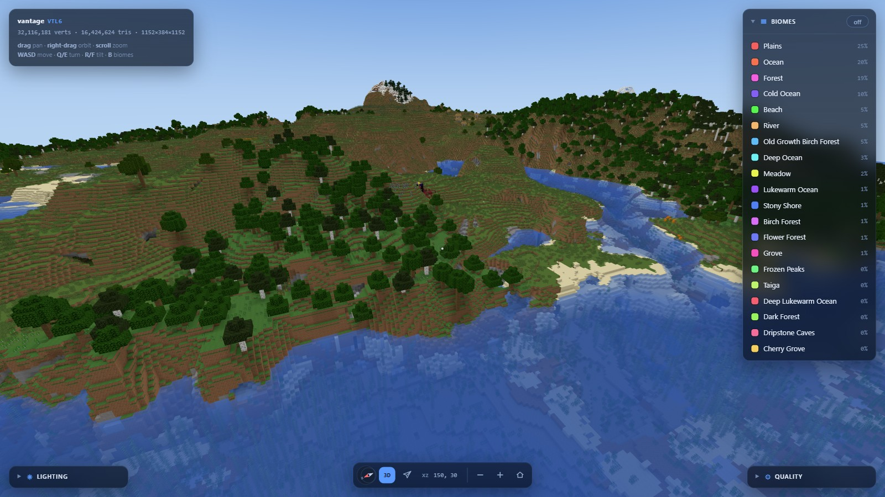
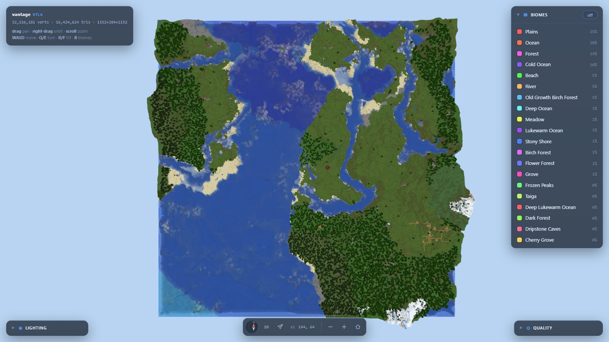
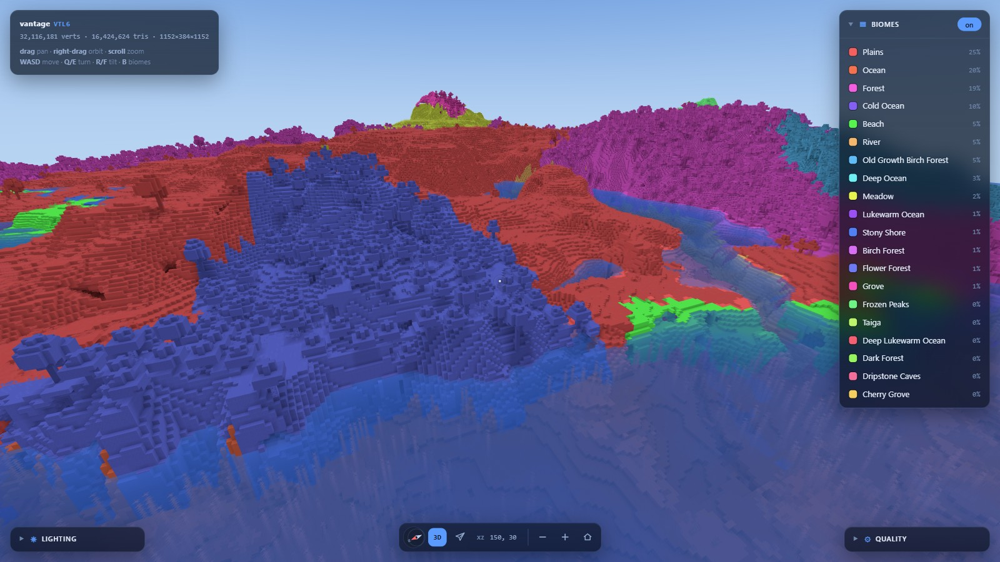

# Vantage

Vantage is a fast, native renderer that turns Minecraft Java Edition worlds into streamable 3D web maps. **[Explore the live demo, downloads, benchmarks, and product guide on the Vantage site →](https://vantage.beacon-mc.io)**

## Choose your path

| I want to… | Start here |
| --- | --- |
| Map worlds on my computer | [Download Vantage Desktop](https://vantage.beacon-mc.io/#desktop) |
| Render or host maps from the command line | [Download the latest CLI release](https://github.com/thoughts-on-things/vantage-mc/releases/latest) |
| Add the viewer to a web app | [`@thoughts-on-things/vantage-mc`](https://www.npmjs.com/package/@thoughts-on-things/vantage-mc) · [package guide](./web/README.md) |
| Run Vantage beside a multiplayer server | [Server overview](https://vantage.beacon-mc.io/server/) · [integration guide](./docs/server.md) |

  
  

## Quick start

| Step | Command |
| --- | --- |
| Extract Minecraft assets | `vantage extract` |
| Render a world | `vantage render "~/.minecraft/saves/My World" --out my-map` |
| Open the finished map | `vantage serve my-map --open` |
| Explore immediately with on-demand rendering | `vantage live "~/.minecraft/saves/My World" --open` |
| Show live players on the map | `vantage live "~/world" --players-file /run/players.json` |

Vantage automatically finds an installed Minecraft client jar when extracting assets, renders every discovered dimension by default, and never writes to the source world. Run `vantage --help` for the complete CLI reference.

Players appear on the map as real 3D player models that walk, turn and carry a
name tag — fed either by a file your server writes (BlueMap's
`live/players.json` works as-is) or, with no setup at all, by the last known
positions in the save itself. See [docs/players.md](./docs/players.md).

## Project links

| Resource | Link |
| --- | --- |
| Product site and live demo | [vantage.beacon-mc.io](https://vantage.beacon-mc.io) |
| Development setup and repository layout | [CONTRIBUTING.md](./CONTRIBUTING.md) |
| Streaming design | [docs/streaming.md](./docs/streaming.md) |
| Live player positions | [docs/players.md](./docs/players.md) |
| Performance roadmap | [docs/performance-roadmap.md](./docs/performance-roadmap.md) |
| Issues and support | [GitHub Issues](https://github.com/thoughts-on-things/vantage-mc/issues) |
| License | [MIT](./LICENSE) |
