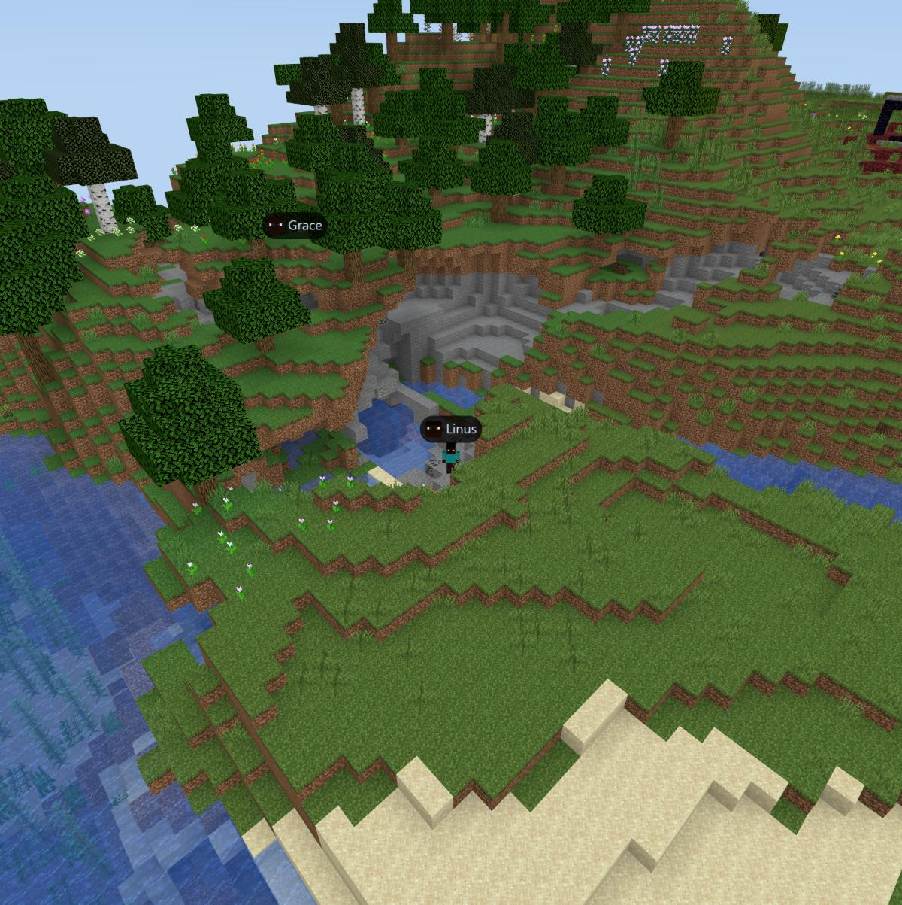
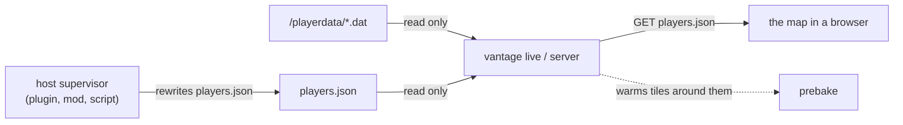

# Live players

Vantage draws the people on your server as actual Minecraft player models,
standing where they stand, walking as they walk. It is one small JSON document
away.





## Where positions come from

Vantage reads persisted world files and never joins the game, so it cannot see
a moving player by itself. Two sources fill that in, and both end up as the same
document beside the manifest.

**A host feed** — `--players-file <path>`. The privileged process that owns the
Minecraft server already knows where everyone is. It writes a small JSON file as
often as it likes and Vantage serves whatever it last wrote. This is the only
genuinely live source, and it is the one to use for a multiplayer map.

**The save itself** — `playerdata/*.dat`, plus `level.dat`'s singleplayer
player. Minecraft persists a player's position on autosave and on quit, so these
are *last known* positions, not live ones. Every player from this source is
flagged `stale` and carries the file's modification time; the map draws them
translucent and the roster says how long ago. It needs no plugin and no
configuration, which is what makes `vantage live <your save>` show your own
character where you left them.

| Command | Default source | Notes |
| --- | --- | --- |
| `vantage render` | the save | Writes a one-off `players.json` snapshot per dimension. |
| `vantage serve` | whatever is in the directory | Static: serves the file the render wrote, or one a host drops in. |
| `vantage live` | the save | `--players-file` switches to a live feed. |
| `vantage server` | **none** | Opt in with `--players-file` (live) or `--players on` (the save). |

`--players off` disables the feature everywhere.

`vantage server` defaults to nothing on purpose. "Where every player who has
ever logged in was last standing" is a different disclosure from "who is online
right now", and a public server map should make that choice deliberately rather
than inherit it. See [Privacy](#privacy).

## The document

`players.json` sits beside `manifest.json` and is a superset of BlueMap's
`live/players.json` — a server already running a BlueMap plugin can point
`--players-file` at the file that plugin is already writing, unchanged.

```json
{
  "format": 1,
  "source": "host",
  "updated": 1785976798928,
  "players": [
    {
      "uuid": "91c71e4a-146c-4788-bbb9-39002556a24e",
      "name": "Notch",
      "foreign": false,
      "position": { "x": 383.22, "y": 70.0, "z": -206.15 },
      "rotation": { "yaw": 8.8, "pitch": 13.9 },
      "dimension": "minecraft:overworld",
      "health": 20.0,
      "gamemode": "survival"
    }
  ]
}
```

Only `uuid` (or `name`) and a position are required. Everything else is
optional, and a host feed may spell things loosely: coordinates may sit in
`position` or flat on the entry, rotation may be `rotation` or flat `yaw` /
`pitch`, the dimension may be `dimension` or `world`, and the whole document may
be a bare array instead of `{ "players": [...] }`.

| Field | Meaning |
| --- | --- |
| `uuid` | Stable identity across polls. Compared, never parsed. |
| `name` | Display name. Falls back to the uuid's first group. |
| `position` | Block coordinates. `y` is the player's feet. |
| `rotation` | Degrees. `yaw` 0 faces south (+Z), increasing toward west; `pitch` is negative looking up. |
| `foreign` | The player is not in the dimension this map covers. |
| `dimension` | Resource id. A dimension the map doesn't cover implies `foreign`. |
| `stale` | The position is a last-known one, not a live report. |
| `seen` | Epoch milliseconds the position was observed. |
| `health`, `gamemode` | Shown in the roster tooltip when present. |
| `skin` | Optional skin image path — see [Skins](#skins). |

An entry Vantage cannot use is dropped on its own. One malformed player never
costs the map the rest of them, and a torn read of a file being rewritten leaves
the previous roster standing rather than blanking the map.

`updated` is taken from the *source's* modification time rather than the clock.
That matters more than it looks: a world where nobody moved re-serializes to
byte-identical JSON, so its `ETag` doesn't move and a polling map settles into
`304 Not Modified` — an open player list on an idle server costs a status line
per second, not a document.

## Writing a feed

Anything that can write a file can drive this. The contract is: write it
atomically (write to a temporary name, then rename), and write it as often as
you want positions to update. Vantage stats the file and only re-reads it when
it moved.

A Paper/Spigot plugin is about fifteen lines:

```java
// Every second, on the main thread.
var players = new ArrayList<Map<String, Object>>();
for (Player p : Bukkit.getOnlinePlayers()) {
    if (p.hasPotionEffect(PotionEffectType.INVISIBILITY) || p.getGameMode() == GameMode.SPECTATOR) continue;
    Location l = p.getLocation();
    players.add(Map.of(
        "uuid", p.getUniqueId().toString(),
        "name", p.getName(),
        "position", Map.of("x", l.getX(), "y", l.getY(), "z", l.getZ()),
        "rotation", Map.of("yaw", l.getYaw(), "pitch", l.getPitch()),
        "dimension", "minecraft:" + p.getWorld().getEnvironment().name().toLowerCase()));
}
Path tmp = Files.writeString(target.resolveSibling("players.json.tmp"), gson.toJson(Map.of("players", players)));
Files.move(tmp, target, StandardCopyOption.REPLACE_EXISTING, StandardCopyOption.ATOMIC_MOVE);
```

Deciding who appears is the host's job, not Vantage's: hide vanished players,
spectators, staff in creative, whoever you like — Vantage draws exactly the
roster it is handed.

The feed doubles as a prebake hint. Live, non-stale player positions are folded
into the same scheduling focus as
[`--focus-file`](./server.md#pointing-the-warm-up-at-your-players), so tiles warm
where your players actually are without configuring it twice.

## Serving it

Under the protocol server the roster is one more protected artifact:

```http
GET /v1/worlds/default/players.json
Authorization: Bearer <secret>
```

It answers `private, no-cache` with a strong `ETag`, so a client that keeps a
copy revalidates rather than re-downloading. `HEAD` never reaches the producer,
like every other dynamic path. The full contract is in
[server-openapi.json](./server-openapi.json).

Locally, `vantage serve` hands over whatever `players.json` is in the directory,
so the BlueMap deployment shape works unchanged: render once, and let your
plugin write its roster into the same folder.

## On the map

The viewer polls the roster about once a second and interpolates between
samples — position linearly, so a walking player crosses the ground at a steady
speed, and rotation with an ease, so a turn reads as a turn. Limb swing is
derived from the measured speed: a running player runs, a standing one stands
still. The body turns toward the direction of travel while the head keeps
looking where the player is looking.

Each player carries a name tag that stays the same size on screen at any zoom,
drawn through terrain so a player is findable from a whole-world view. Clicking
one in the roster flies the camera to them; the pin follows them as they move,
and panning the map lets go.

A quiet roster relaxes the poll cadence, and a world that serves no roster at
all is discovered in three failed requests and then left alone — a plain render
costs nothing for a feature it doesn't have.

```tsx
import { PlayerList, VantageViewer } from '@thoughts-on-things/vantage-mc/react';

<VantageViewer world="/manifest.json" players={{ names: true, offline: false }}>
  <PlayerList />
</VantageViewer>;
```

| Setting | Default | Effect |
| --- | --- | --- |
| `enabled` | `true` | Draw players at all. |
| `names` | `true` | Name tags above each player. |
| `offline` | `true` | Show last-known (`stale`) positions. |
| `foreign` | `false` | Place players from other dimensions on this map. |
| `scale` | `1` | Model size multiplier — a whole-world view can exaggerate. |
| `tagSize` | `0.03` | Name-tag height as a fraction of the viewport. |
| `path` | `players.json` | Roster path, relative to the manifest. |
| `pollMs` | `1000` | Cadence while players are moving. |

Without React, the engine exposes the same thing: `viewer.players`,
`viewer.setPlayers(...)`, `viewer.focusPlayer(uuid)`,
`viewer.followPlayer(uuid | null)`, and a `players` event.

## Skins

Vantage draws every player with a complete Minecraft player model — head, body,
arms, legs, and the outer layer — and by default gives each one a procedurally
generated skin derived from their id. It is not Steve and not Alex: the colours
come from the player's own uuid, so a server full of unskinned players reads as
a crowd of distinct people, and Vantage ships no Mojang artwork.

Vantage deliberately does **not** call a public skin service. Asking
`crafatar.com` (or any other) for a face tells that service both who is on your
server and who is looking at your map, from the viewer's own IP. That should be
your decision, not a default.

Two ways to supply real skins:

- **Serve them yourself.** Put a `skin` on each roster entry, as a plain
  relative path inside the map's own directory (`skins/<uuid>.png`). Vantage
  fetches it through the same authenticated transport as every other artifact,
  and rejects anything that could leave that origin — a scheme, a host, a
  traversal, a backslash. The protocol server does not serve skin files itself
  in v1; a static `vantage serve` directory or your own proxy does.
- **Resolve them in the page.** Pass `players={{ resolveSkin }}` and return a
  URL. This is the escape hatch for hosts that already run or proxy a skin
  service.

Both the classic 64×64 layout and legacy 64×32 sheets are supported (the missing
left limbs are mirrored in, as Minecraft does), as are slim ("Alex") arms.

## Privacy

A live player map is a live location feed for real people. Treat it that way.

| Risk | What Vantage does |
| --- | --- |
| Positions exposed to anyone who can reach the map | The roster is a protected artifact behind the same authorization as the terrain; `private, no-store`/`no-cache`, never in a shared cache. |
| Offline players' last known positions leaking | `vantage server` reads no player files unless asked (`--players on`); the local commands, where the map and the save belong to the same person, default to on. |
| A roster pointing the viewer at another origin | `skin` accepts only a plain relative path inside the map's own directory; anything else is dropped, not forwarded. |
| A third party learning who plays and who watches | No skin service is contacted by default. |
| The map disclosing more than the host meant | The host feed is served verbatim: whatever the supervisor writes is what appears, so hiding vanished or spectating players is decided where that decision belongs. |
| A tampered roster widening what is served | It cannot. The feed is read-only, size-capped, and only ever reorders prebake — it can never make a tile or a path servable that wasn't already. |

Tell your players the map exists. On most servers that is the whole of the
consent story, but it is not optional.
