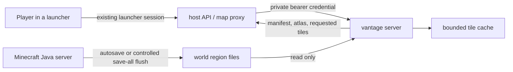

# Multiplayer world serving

`vantage server` is the multiplayer data plane for Vantage. It runs beside a
Minecraft Java server, reads that server's world files, renders tiles lazily,
and exposes the versioned Vantage world protocol to an authenticating host — a
launcher backend, server web portal, or reverse proxy. Players can explore a
server map without downloading the save and without granting Vantage their
Minecraft, Microsoft, or launcher credentials.

The machine-readable protocol contract is
[server-openapi.json](./server-openapi.json).

The design deliberately separates two responsibilities:

- **The launcher or server host owns identity and authorization.** It already
  knows which player a session belongs to, and it keeps making the access
  decision.
- **Vantage owns rendering and artifact streaming.** It has read-only world
  access, a bounded bake scheduler, and no account database or public control
  plane.



## Why a sidecar

A multiplayer client does not have the authoritative Anvil region files. It
only receives a moving window of chunks and cannot reconstruct unexplored or
unloaded terrain. A server plugin could stream blocks, but that puts expensive
render extraction on the tick thread, couples support to server implementations,
and expands the protocol surface considerably.

The sidecar reads the same persisted region format as desktop Vantage, works
with vanilla and modded servers without injecting code, and fails independently
of the game server. Its only required capabilities are:

- read access to the selected save and `level.dat`;
- read access to an extracted Minecraft client asset set;
- write access to a dedicated Vantage cache;
- a private network path to the authenticating host.

Minecraft 1.21.9 introduced an optional JSON-RPC management server over
WebSocket. It is useful for future save coordination and lifecycle
notifications, but it does not provide world block data, so it complements
rather than replaces the region-file sidecar. Mojang and Paper both default it
to localhost with bearer authentication and TLS controls; Vantage follows the
same private-control-plane shape. See the
[Minecraft 1.21.9 release notes](https://www.minecraft.net/en-us/article/minecraft-java-edition-1-21-9)
and [Paper server-properties reference](https://docs.papermc.io/paper/reference/server-properties/).

## Run it

### Local development walkthrough

The repository includes a supervised, end-to-end development stack. From the
repository root:

```sh
just server-dev
```

It performs the complete launcher-facing flow:

1. validates the world and local ports, installs the viewer dependencies when
   they are missing, and builds an optimized sidecar;
2. creates a new cryptographically random bearer without putting it in the
   command line, URL, or logs;
3. starts `vantage server` on loopback with CORS restricted to the local
   viewer, then waits for its health endpoint;
4. starts the viewer with `worldFromVantageServer`, waits until it is ready,
   and opens it in the default browser; and
5. prefixes both services' logs in one terminal and stops both on `Ctrl+C`.

The bundled `site/demo-world` makes the first run reproducible. Point the same
flow at a Java server's actual world directory to test persisted multiplayer
changes:

```sh
just server-dev "C:\minecraft-server\world"
just server-dev /srv/minecraft/world
```

The default on-demand cache is `.vantage-dev/server-cache`, so restarts are
fast while new region revisions still invalidate affected tiles. Run
`just server-dev-help` to inspect port, cache, scan interval, and
browser behavior. `--skip-build` shortens repeated native iterations.

For an automated proof of the same stack, use:

```sh
just server-smoke
```

It checks public discovery, a rejected unauthenticated request, an authorized
continuous manifest, exact-origin CORS, tile revisions, and one actual lazy
bake. It exits only after both child processes have stopped, making it suitable
for local preflight and CI. The injected bearer is intentionally visible to
the local browser process; because it is fresh per run and the sidecar binds to
loopback, it is a development convenience—not a production authentication
pattern.

### Production sidecar

When the authenticating host runs on the same machine, keep the listener on
its default loopback address. No bearer is required because only the
authenticating local proxy can reach it:

```sh
vantage server /srv/minecraft/world \
  --assets /srv/vantage/assets/minecraft \
  --out /var/cache/vantage/world \
  --memory 1024 \
  --threads 8
```

When the host and Vantage run in separate containers, put them on a private
network and use an internal secret. `vantage server` refuses a non-loopback
bind unless the environment variable contains at least 32 bytes:

```sh
export VANTAGE_SERVER_TOKEN="$(openssl rand -base64 32)"
vantage server /data/world \
  --assets /data/assets/minecraft \
  --out /cache/world \
  --host 0.0.0.0 \
  --token-env VANTAGE_SERVER_TOKEN
```

The secret is read from the environment, hashed immediately, never accepted on
the command line, and never printed. Send it as an HTTP header:

```http
Authorization: Bearer <secret>
```

Terminate HTTPS at a trusted reverse proxy, the platform load balancer, or the
authenticating host itself.
Do not expose the native HTTP listener or send a bearer token over cleartext
outside a trusted loopback/private network. This follows the bearer-token
requirements in [RFC 6750](https://www.rfc-editor.org/rfc/rfc6750).

Useful server-specific flags are:

| Flag | Default | Purpose |
| --- | --- | --- |
| `--scan-interval <seconds>` | `5` | Minimum interval between world change checks. |
| `--max-connections <n>` | `64` | Hard cap on concurrent HTTP connection workers. |
| `--allow-origin <origin>` | none | Exact browser origin allowed by CORS; repeatable. |
| `--token-env <name>` | `VANTAGE_SERVER_TOKEN` | Environment variable holding the internal bearer. |
| `--prebake on\|off` | `on` | Background-bake the world with idle bake slots (see below). |
| `--focus-file <path>` | none | JSON file of block coordinates prebake warms around (see below). |

All `vantage live` render controls also apply, including `--radius`,
`--tile-chunks`, `--caves`, `--light`, `--biome-blend`, `--gz`, `--memory`, and
`--threads`.

## Protocol v1

The initial protocol serves one world called `default`. One sidecar process per
Minecraft server keeps ownership, caches, and failure domains explicit; the
world-list shape leaves room for a future multi-world supervisor.

| Request | Authentication | Result |
| --- | --- | --- |
| `GET /.well-known/vantage` | public | Protocol and authentication discovery. |
| `GET /v1/health` | public | Process liveness, not world readiness or access. |
| `GET /v1/openapi.json` | public | The exact OpenAPI 3.1 protocol contract. |
| `GET /v1/worlds` | required | Authorized world descriptors. |
| `GET /v1/worlds/default/manifest.json` | required | Current world manifest. |
| `GET /v1/worlds/default/terrain.vtexarr` | required | Current texture array. |
| `GET /v1/worlds/default/tiles/t.X.Z.vtile` | required | Cached or on-demand geometry tile. |

`HEAD` may inspect an existing static cache entry but never starts a bake or
builds an atlas. `OPTIONS` supports a strict CORS preflight. Other methods are
rejected because the component has no remote mutation or administration API.

Protected responses use `private, no-store`, except tiles — see
[Tile revalidation](#tile-revalidation). Bearer credentials belong in
`Authorization`, never query strings. Browser access is opt-in per exact
scheme/host/port with `--allow-origin`; wildcard or suffix matching is not
supported. Responses include `Vary: Origin`, as required for origin-specific
caching by the [Fetch Standard](https://fetch.spec.whatwg.org/).

Manifest tiles from a continuous server carry an opaque `revision` string. A
client that polls the dynamic manifest keeps unchanged GPU tiles resident,
unloads only removed or changed revisions, and fetches replacements on demand.

The manifest response also carries a strong `ETag` over its exact body
(exposed to cross-origin scripts). A poll that presents it via
`If-None-Match` answers `304 Not Modified` with no body while the catalog is
unchanged, so an idle map costs a status line per poll instead of the full
tile list. The bundled viewer does this automatically; clients that never
send `If-None-Match` see identical protocol v1 behavior.

The built manifest is cached server-side per change generation, so idle
conditional polls cost a counter compare rather than an O(tiles) rebuild, and
changed manifests travel `Content-Encoding: gzip` to clients whose
`Accept-Encoding` admits it — on a large world the tile catalog is megabytes
of repetitive JSON and is re-fetched every poll while tiles bake. Prebake
lands tiles faster than clients poll, which would otherwise move the
generation on every poll and defeat that cache exactly when rebuilding is
most expensive, so a representation is also shared for up to a second past
its generation: one rebuild per second serves every watching client, and the
tiles that landed inside the window appear on the next poll.

### Tile revalidation

A tile's bytes are fixed by its manifest `revision`, so a client that already
has one never needs it again. Responses for advertised tiles therefore carry
a strong `ETag` and `Cache-Control: private, no-cache` — storable, but never
usable without revalidating. A conditional fetch that matches answers `304`
before any transfer, any disk read, and, on a tile that has not been baked
yet, any bake at all. Panning back over explored terrain after a reload costs
a status line per tile instead of a megabyte. (A well-formed coordinate the
manifest does not advertise stays an empty `200` with no `ETag` and the
default `private, no-store`: there is no revision to validate it against. An
advertised tile that merely meshed to nothing does have one, and revalidates
like any other.)

The validator is `"<session>-<revision>"`. The session half is a per-process
random tag, and it is load-bearing: tile payloads address the texture array
by layer index, layers are assigned in the order the bakes encountered them,
and so a tile is only interchangeable with one from the same process. Within
a session layers are only ever appended, which is what keeps an early tile
valid as the atlas grows. Across a restart the world revision may be
identical and the tile still is not, so the session tag makes the old
validator deliberately unmatchable rather than serving a tile against an
atlas it was not baked for.

### Background prebake

On-demand baking alone means every first look at an area waits a full tile
bake. With `--prebake on` (the default), idle bake slots continuously bake the
unbaked tile nearest a focus point — spawn-outward until something better is
known — so exploration mostly lands on warm cache. Interactive fetches keep
priority: prebake workers stand down while any viewer request is waiting for a
bake permit, and one slot's worth of headroom is reserved for them. A
background tick scans the world at `--scan-interval` whether or not anyone is
connected, so a save advances tile revisions and the same loop re-bakes the
changed tiles on its own. The cache therefore converges on a full render of
the world even on an unwatched server; disable with `--prebake off` if disk or
CPU budget forbids that.

Concurrency is what prebake throughput and cold-start latency actually scale
with. `--threads` is a ceiling on simultaneous bake arenas, and prebake takes
all but one of them, so `--threads 1` leaves a viewer's first look queued
behind a background bake. Give a dedicated sidecar at least two.

### Pointing the warm-up at your players

Left alone, prebake warms outward from spawn until a viewer's tile request
gives it something better to aim at. A host usually knows more than that: it
knows where its players are standing right now, long before any of them opens
the map. `--focus-file <path>` hands that knowledge over.

The file is a small JSON document the host rewrites whenever it likes, in
**block** coordinates — the host knows where players are, not how this process
was told to tile the world:

```json
{ "points": [{ "x": 118, "z": -2043 }, { "x": -560, "z": 380 }] }
```

Vantage stats the file on each scan tick and re-reads it only when it moved.
Points are converted to tile coordinates, de-duplicated (a whole team in one
base is one candidate, not five), and capped at 16. Prebake then picks the
unbaked tile nearest *any* focus point, plus wherever a viewer last looked, so
several separated bases warm in parallel rings instead of the empty ocean
between them. Write it atomically (write-then-rename) if you can; a
half-written or malformed file is ignored with a single log line and the
previous focus stands. A missing file simply means "no host focus" — this is a
scheduling hint, and nothing about the map depends on it.

This deliberately stays a file rather than an endpoint. The sidecar's data
plane is GET-only with no remote mutation surface, and the privileged
supervisor that owns the save path already owns a filesystem it can write to.

## Host integration

A server host that already authenticates its players has the right trust
boundary: its launcher or web routes establish and enforce the session, and
its admin tier owns the Minecraft process and save path. Vantage should plug
into that boundary rather than introduce another player identity system.

The recommended integration for a host that currently ships periodic full-map
renders is:

1. Start one long-running `vantage server` for the save. Keep its cache on
   persistent storage and its listener reachable only from the host's service
   tier.
2. Keep the host's existing map session middleware. Add a streaming proxy
   below a stable same-origin prefix such as `/map-app/world/`.
3. On every request, validate the player's existing session. Remove any
   client-supplied `Authorization` header, then attach the Vantage internal
   bearer before forwarding to `/v1/worlds/default/`.
4. Pass `If-None-Match` and `ETag` through the proxy in both directions, and
   keep the browser-facing `Cache-Control` revalidatable rather than
   `no-store`. Without that, every tile is re-transferred on every reload.
5. Apply player/session rate limits at the host or the edge. Never expose an
   endpoint that lets a player choose a filesystem path, cache directory,
   command, or arbitrary tile coordinate.
6. Return the session-gated manifest URL to the launcher. A browser can use the
   same-origin proxy directly; a native launcher can provide its existing
   session header through `worldFromHttp`.
7. Optionally, have the supervisor write online players' positions to a
   `--focus-file` so the map is already warm where they are.

```ts
import { worldFromHttp } from '@thoughts-on-things/vantage-mc/core';

const world = await worldFromHttp(
  `${hostOrigin}/map-app/world/manifest.json`,
  {
    accessToken: hostSession,
    fetch: nativeHttpFetch, // e.g. the launcher's native HTTP transport
    label: hostLabel,
  },
);

const viewer = await VantageViewer.mount(container, { world });
```

The Vantage client confines every manifest-owned artifact path to the
manifest's HTTP origin and directory before attaching credentials. An absolute
URL, encoded traversal, backslash, empty path segment, or `..` is rejected, so
a compromised manifest cannot redirect the player's session token elsewhere.

A generic launcher that connects directly to a TLS-terminated Vantage endpoint
can use the protocol helper instead:

```ts
import { worldFromVantageServer } from '@thoughts-on-things/vantage-mc/core';

const world = await worldFromVantageServer('https://map.example.net/', {
  accessToken: serverMapToken,
});
```

## Continuous consistency and performance

The sidecar never writes to the Minecraft save. Minecraft remains responsible
for persisting live chunks; Vantage observes them on the next scan. If the
host needs a stronger freshness point, its privileged supervisor may issue
`save-all flush` before a planned snapshot. That operation must not be exposed
to map clients, and should be debounced because it can pause a busy server.

Each refresh is an immutable, reference-counted epoch:

1. The frequent gate scans only region filename, size, and modification time.
2. After a change, Vantage reads each affected catalog's 4 KiB location table
   with file metadata checked before and after the read. An unstable read is
   discarded and retried on a later scan.
3. Populated chunks and render tiles are enumerated from the location tables.
   A region-coordinate index computes each tile's revision from only the region
   files intersecting that tile and its one-chunk seam apron.
4. The new epoch is swapped under a short mutex. In-flight requests retain the
   old epoch until their bake finishes, avoiding both torn catalogs and
   use-after-free.
5. Tile files are written atomically. Duplicate concurrent fetches for one
   tile coalesce into a single bake, while a semaphore bounds simultaneous
   per-tile arenas from `--threads` and `--memory`.

The resulting costs are:

| Operation | Cost |
| --- | --- |
| Unchanged refresh | O(region files) metadata; no chunk payload reads. |
| Changed catalog | 4 KiB per region plus O(populated chunks) enumeration. |
| Tile revision | O(overlapping regions), normally one to four. |
| Tile bake | One tile plus seam apron; bounded concurrent working sets. |
| Repeated tile fetch | Disk cache read; no rebake. |
| Revalidated tile fetch | `304 Not Modified`; no read, no transfer, no bake. |
| Duplicate in-flight fetch | Waits for and shares the leader's result. |
| Unchanged manifest poll | `304 Not Modified`; headers only, no body. |

Chunk payloads are positional reads into a per-tile arena; they are not kept in
the long-lived world catalog. World size therefore affects compact indexes and
cache size, not the expensive resident bake working set.

## Threat model and operating rules

| Risk | Mitigation |
| --- | --- |
| World disclosure | Host/session authorization remains outside Vantage; every artifact route is protected. |
| Secret leakage | Environment-only secret, in-memory SHA-256, constant-time comparison, no URL credentials, `no-referrer`. |
| Cross-origin token use | Exact CORS allowlist, preflight, `Vary: Origin`, duplicate security headers rejected. |
| Path traversal or credential exfiltration | Protocol-artifact allowlist, conservative path grammar, and client-side same-origin/directory confinement. |
| Bake amplification | Only manifest-advertised tile coordinates can bake; duplicate work coalesces. |
| Memory/connection exhaustion | Byte-derived bake semaphore, connection cap, and finite requests per keep-alive connection. |
| Partial cache files | Atomic replacement after a successful bake. |
| Save races | Stable location-table reads and reference-counted epochs; failed scans retain the last good snapshot. |
| Stored tile copies | Tiles are `private` and `no-cache`: shared caches are excluded and a stored copy is unusable without a revalidation the host still authorizes. |
| Focus-file tampering | Read-only, size-capped, schedule-only: it can reorder prebake, never widen what is served or advertised. Keep it writable by the supervisor alone. |

The map can disclose player builds, explored terrain, and—in full-cave mode—
underground structures. Treat it as private server data. Run the process as a
dedicated unprivileged account, mount the world read-only where possible, keep
the cache separate, rotate internal bearer secrets, and enforce request-rate,
body-size, header-size, idle-timeout, TLS, and audit policy at the edge proxy.

## Current boundaries

- Java Edition Anvil saves and the overworld are supported. Other dimensions
  should become explicit world IDs rather than filesystem parameters supplied
  by a client.
- Vantage renders persisted terrain, not players, entities, inventories, chat,
  or live chunk packets.
- The sidecar is an HTTP data plane, not a Minecraft remote administration
  service. It cannot start, stop, save, or execute commands on the server.
- Low-resolution whole-world pyramid generation remains a batch-render
  feature. Continuous serving currently streams high-resolution tiles.
- Native TLS is intentionally out of scope; public deployments require a
  trusted TLS reverse proxy.

These boundaries keep protocol v1 small and auditable. Future additions—more
dimensions, host-pushed invalidations from Minecraft's management protocol,
entity overlays, or shared object storage—can extend the world descriptor and
artifact streams without moving identity or server control into Vantage.
